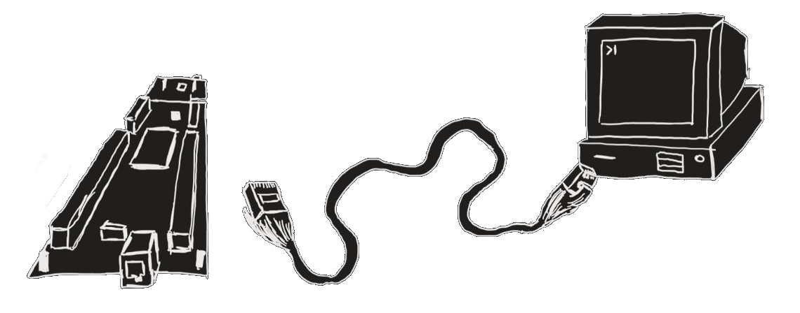

# CAN to Ethernet Sniffer (With STM32H7 Nucleo)

## Project Overview

This project was developed as part of a Master's subject in Computer Engineering and Networks (UPV, Valencia). It is based on the **STM32H743ZI Nucleo** microcontroller, which sniffs messages from a **CAN (Controller Area Network)** bus and transmits them over Ethernet. The captured data can be visualized in **Wireshark** using a custom plugin that has been written in **C** and compiled directly into the Wireshark source code.

## Features

- **CAN Bus Sniffing**: Captures CAN messages from a CAN network using the STM32H743ZI microcontroller.
- **Ethernet Transmission**: Sends the captured CAN data over Ethernet using the STM32’s built-in Ethernet interface.
- **Wireshark Integration**: A custom plugin written in C allows Wireshark to parse and display CAN packets received over Ethernet.

## Requirements

### Hardware:
- **STM32H743ZI Nucleo Board**: Microcontroller board used for CAN sniffing and Ethernet transmission.
- **CAN Transceiver**: Connects the STM32H743ZI to the CAN bus network. Waveshare RS485 HAT has been used during development (https://www.waveshare.com/rs485-can-shield.htm).

### Software:
- **STM32CubeIDE**: IDE for developing and flashing the firmware onto the STM32 board.
- **STM32CubeMX**: Tool for configuring the STM32 peripherals.
- **Wireshark**: Network protocol analyzer, with the custom C-based plugin for CAN packet decoding.

## Setup and Installation

### 1. STM32 Firmware Setup

1. **Clone this repository** and open the project in **STM32CubeIDE**.
2. Connect the STM32H743ZI Nucleo board to your computer via USB.
3. In **STM32CubeMX**, configure the following:
   - **CAN Peripheral**: Ensure the CAN interface is set up to match your CAN network.
   - **Ethernet Peripheral**: Configure the LwIP settings for data transmission over your network, address, mask and gateway.
4. Build and flash the project to the STM32 board.

### 2. Wireshark Plugin Setup

1. **Clone the Wireshark repository** from [Wireshark's official Git repository](https://gitlab.com/wireshark/wireshark).
2. **Create plugin directory**: `mkdir plugins/can`
3. **Copy the custom plugin code** from this repository to the new one.
4. Add the new plugin entry in the Wireshark `CMakeLists.txt` file, located on the root of the wireshark directory. Look for the "set(PLUGIN_SRC_DIRS)" directive and add:
   `plugins/can`
5. You can now filter by can_udp type whenever you receive the packets from the board.
